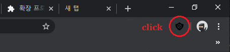

# 구글 광고 가리는 크롬 확장프로그램
- 구글 광고때문에 모니터 한화면에 안들어오는게 답답해서 만듬
- Ebook 사이트(https://thebook.io/)에 특화한 기능 추가하였다.
  - ~~책넘기는 메뉴 위로 이동하는 기능~~ [추가]
  - ~~메뉴 오른쪽으로 옮기는 기능~~ [추가]
  - ~~해당 영역 없어도 에러 안나게 방어 코딩~~ [추가]
  - ~~메뉴 오른쪽으로 옮기는 기능~~ [추가]

# chrome Add block extension
## How to use (한국인이면 스샷보고 따라하세요)
- Settings -> Extensions

- click "LOAD INPACKED"

- choice a folder path. It is your download path from github repository

- check to added extension in your chrome

- If you block google add, just click icon

### thanks for use!
